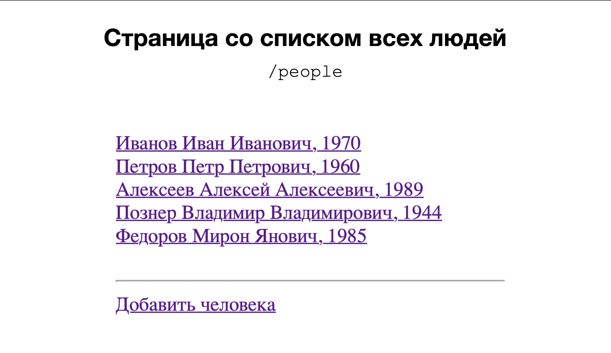
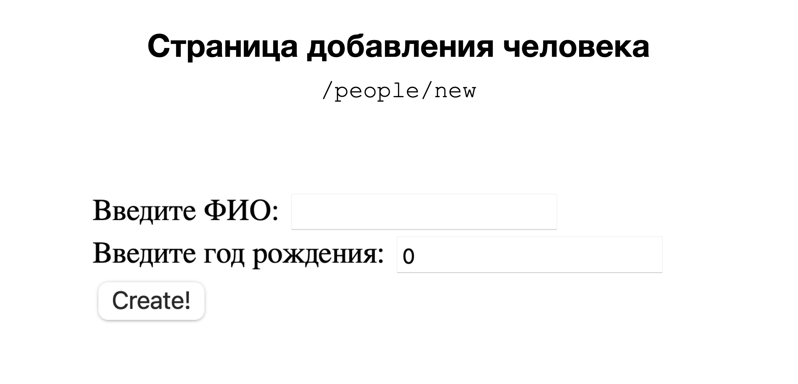
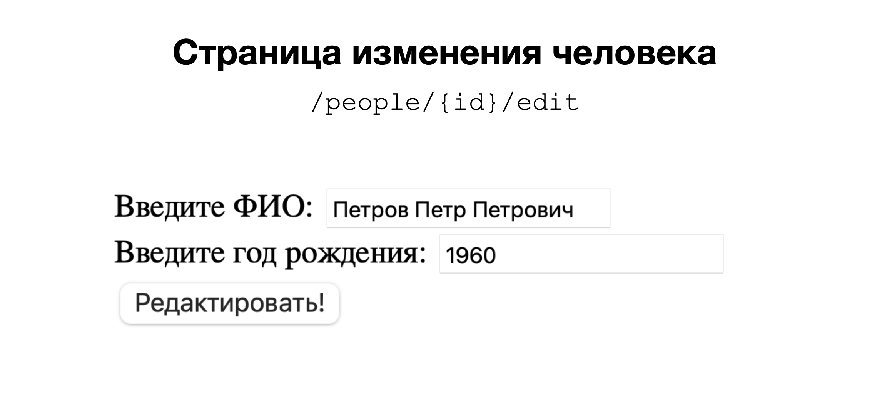
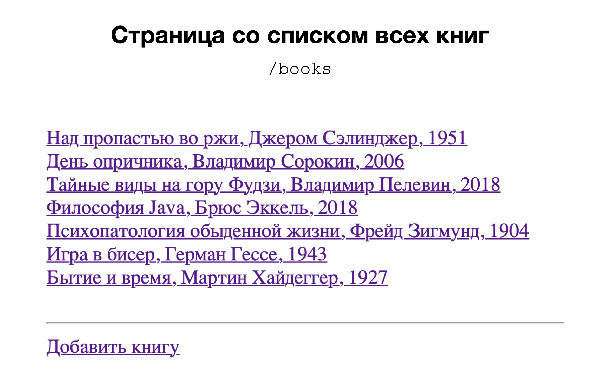
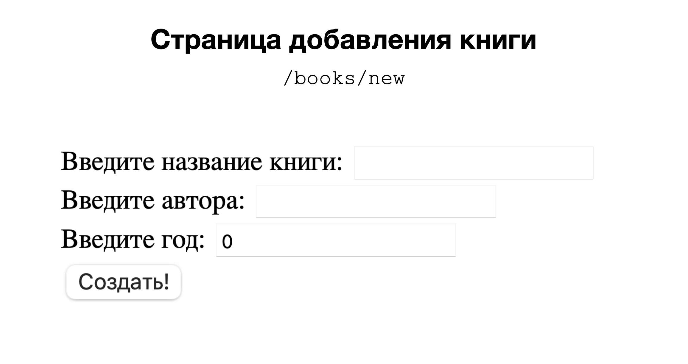
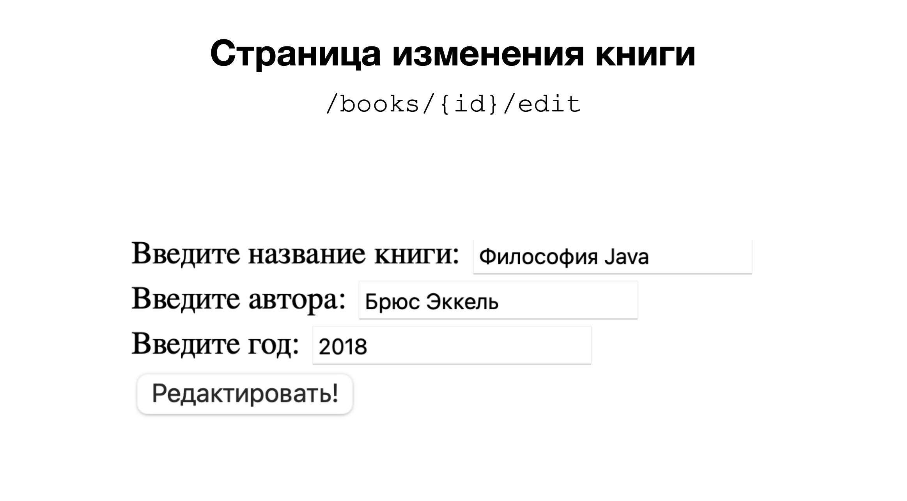
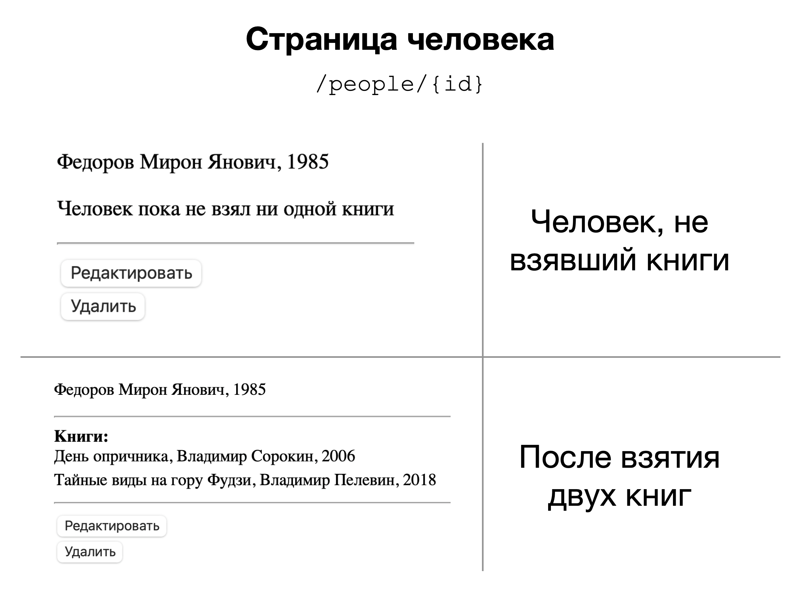
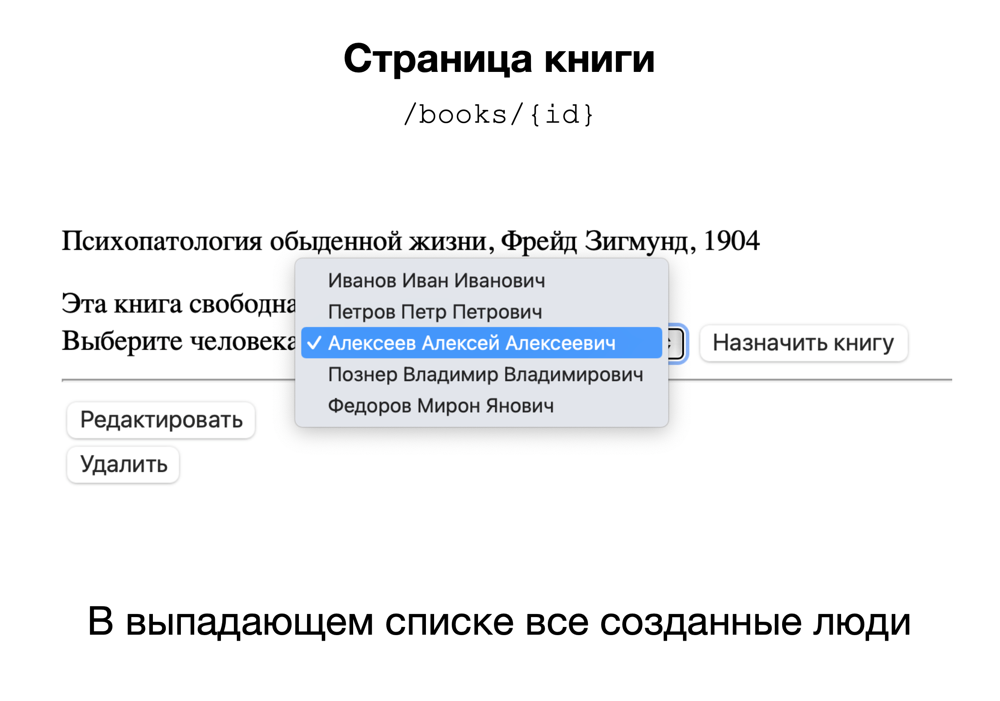
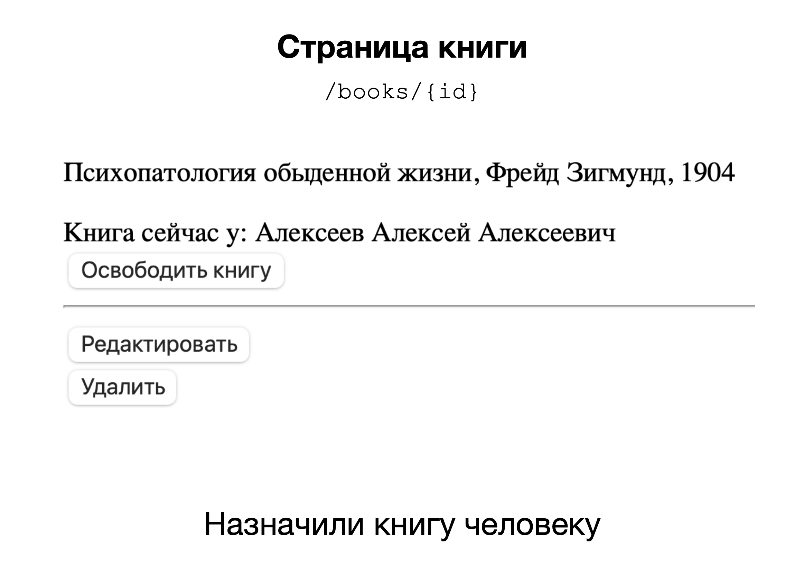

# Library App

---

### Задача:
Реализовать веб-приложение цифрового учета книг для местной библиотеки. 
Библиотекари должны иметь возможность регистрировать читателей, выдавать им книги и освобождать книги (после того, как читатель возвращает книгу обратно в библиотеку).

### Функционал:

1) Страницы добавления, изменения и удаления человека.
2) Страницы добавления, изменения и удаления книги
3) Страница со списком всех людей (люди кликабельные - при клике осуществляется
   переход на страницу человека).
4) Страница со списком всех книг (книги кликабельные - при клике осуществляется
   переход на страницу книги).
5) На странице человека показаны значения его полей и список книг, которые он
   взял. Если человек не взял ни одной книги, вместо списка - текст "Человек
   пока не взял ни одной книги".
6) На странице книги показаны значения полей книги и имя человека,
   который взял эту книгу. Если эта книга не была никем взята, появится текст "Эта
   книга свободна".
7) На странице книги, если книга взята человеком, рядом с его именем кнопка
   "Освободить книгу". Эта кнопка нажимается библиотекарем тогда, когда читатель возвращает эту книгу обратно в библиотеку. После нажатия на эту кнопку книга снова становится свободно и пропадает из списка книг человека.
8) На странице книги, если книга свободна, появляется выпадающий список со всеми людьми и кнопка "Назначить книгу". Эта кнопка нажимается библиотекарем
   тогда, когда читатель хочет забрать эту книгу домой. После нажатия на эту кнопку, книга начинает принадлежать выбранному человеку и должна появится в его списке книг.
9) Все поля провалидированы.

---

### Примеры
#### Страница со списком всех людей

#### Страница добавления человека

#### Страница изменения человека

#### Страница со списком всех книг

#### Страница добавления книги

#### Страница изменения книги

#### Страница человека

#### Страница книги

#### Страница книги

---